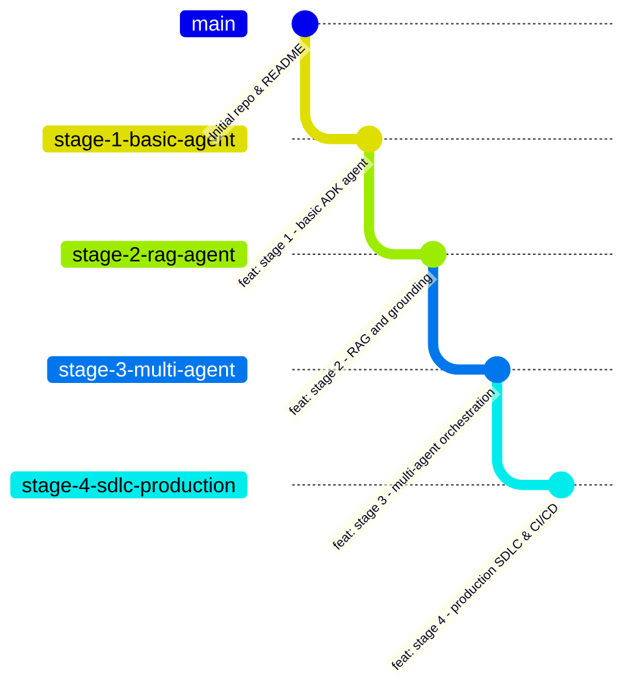

# SDLC Workshop & Progressive Agentic Course Generator

A comprehensive framework and automation toolkit for teaching and developing progressive, multi-stage agentic applications using **Google Agent Development Kit (ADK)**, **Git Worktrees**, **GitHub Comparison Pull Requests**, and **Prompt Trajectories**.

---

## 📖 Overview

When leading students or engineers through building complex agentic systems, showing the linear evolution from a basic agent to a production-ready multi-agent system can be challenging. Standard git checkouts cause IDE churn and make side-by-side comparison difficult.

This repository provides:
1. **A 4-Stage Progressive Blueprint** for teaching Google ADK application development.
2. **An automated setup script (`setup-worktree-repo.sh`)** that scaffolds a new repository with sequential feature branches, local Git Worktrees for live demos, and open GitHub Pull Requests that display clean visual diffs between stages.
3. **A Trajectory Walkthrough Toolkit (`walk-trajectories.sh` + `trajectories/`)** to interactively step through and replay the exact prompts that evolved the code at each stage.
4. **An automated `record-trajectory` Workspace Skill** that records your prompt trajectory as you build each stage for the first time.

---

## 🏗️ 4-Stage Progressive ADK Architecture Plan



### Stage 1: Basic ADK Agent (`stage-1-basic-agent`)
* **Learning Objectives**: Fundamentals of Google ADK, defining an agent, system instructions, model parameters, and custom tools.
* **Directory Structure**:
  ```text
  ├── pyproject.toml / requirements.txt
  ├── README.md
  └── src/
      ├── __init__.py
      ├── agent.py          # Core ADK agent definition
      └── tools.py          # Basic custom Python function tools
  ```

---

### Stage 2: RAG & Knowledge Grounding (`stage-2-rag-agent`)
* **Learning Objectives**: Vector search retrieval, knowledge grounding, and prompt engineering for source citation.
* **Key Evolution**:
  ```diff
    src/
    ├── agent.py          # Updated instructions for grounding & citation
    ├── tools.py          # Added retrieval/search tool
  + ├── retrieval.py      # Embedding & vector search connection logic
  + └── data/             # Sample documents or knowledge base scripts
  ```

---

### Stage 3: Multi-Agent System (`stage-3-multi-agent`)
* **Learning Objectives**: Sub-agent specialization, Router/Coordinator orchestration patterns, and state hand-offs.
* **Key Evolution**:
  ```diff
    src/
  - ├── agent.py
  + ├── coordinator.py    # Primary router/orchestrator agent
  + ├── subagents/
  + │   ├── __init__.py
  + │   ├── researcher.py # RAG specialist agent
  + │   └── reviewer.py   # Code/fact checker or formatter agent
    ├── retrieval.py
    └── tools.py
  ```

---

### Stage 4: Production SDLC & DevOps (`stage-4-sdlc-production`)
* **Learning Objectives**: ADK Quality Flywheel evaluations, CI/CD pipelines (GitHub Actions), containerization, and Cloud Trace observability.
* **Key Evolution**:
  ```diff
  + .github/
  + └── workflows/
  +     ├── test.yaml         # CI pipeline (lint + unit tests)
  +     └── eval.yaml         # Automated agent evaluation on PRs
  + evals/
  + ├── golden_dataset.json   # Benchmark questions & expected trajectories
  + └── run_evals.py          # Eval script using ADK eval runner
  + Dockerfile                # Production containerization
  + deployment.yaml           # Deployment config (Cloud Run / GKE)
    src/                      # Instrumented with tracing & logging
  ```

---

## 🚀 Using `setup-worktree-repo.sh` for New Courses

The `setup-worktree-repo.sh` script automates creating a new GitHub repository configured for teaching this 4-stage progression.

### Quickstart Guide

1. **Navigate to this workshop directory**:
   ```bash
   cd ~/git/sdlc-workshop
   ```

2. **Customize the script configuration** (optional):
   Open `setup-worktree-repo.sh` and edit the configuration block at the top if you want a custom repository name or visibility:
   ```bash
   REPO_NAME="adk-progressive-agent-course"
   REPO_VISIBILITY="--public"   # or --private
   ```

3. **Run the automation script**:
   ```bash
   bash setup-worktree-repo.sh
   ```

4. **Verify your local Worktree structure**:
   Once execution finishes, navigate into your generated course folder:
   ```text
   adk-progressive-agent-course/
   ├── README.md
   └── .worktrees/
       ├── stage-1/  # Checked out to branch 'stage-1-basic-agent'
       ├── stage-2/  # Checked out to branch 'stage-2-rag-agent'
       ├── stage-3/  # Checked out to branch 'stage-3-multi-agent'
       └── stage-4/  # Checked out to branch 'stage-4-sdlc-production'
   ```

5. **Open in your IDE**:
   You can add each `.worktrees/stage-X` directory to your editor workspace to live-demo and compare stages side-by-side without ever running `git checkout`.

---

## 🔀 GitHub Comparison PRs as a Teaching Aid

When teaching, direct your students to the **Pull Requests** tab of the generated GitHub repository. They will see three open PRs:
* **PR #1**: `stage-2-rag-agent` → base: `stage-1-basic-agent`
* **PR #2**: `stage-3-multi-agent` → base: `stage-2-rag-agent`
* **PR #3**: `stage-4-sdlc-production` → base: `stage-3-multi-agent`

Students can click on **Files changed** in any PR to see an exact, clutter-free visual diff of what was added or modified to transform the application from one stage to the next.

---

## 🎯 Replaying Trajectories (`walk-trajectories.sh`)

During live demos, use the interactive trajectory walker:
```bash
./walk-trajectories.sh trajectories/stage_1.md --commit
```
It displays each step, **copies the prompt to your macOS clipboard (`pbcopy`)**, pauses while you paste it into your coding harness, and automatically creates a Git checkpoint.
