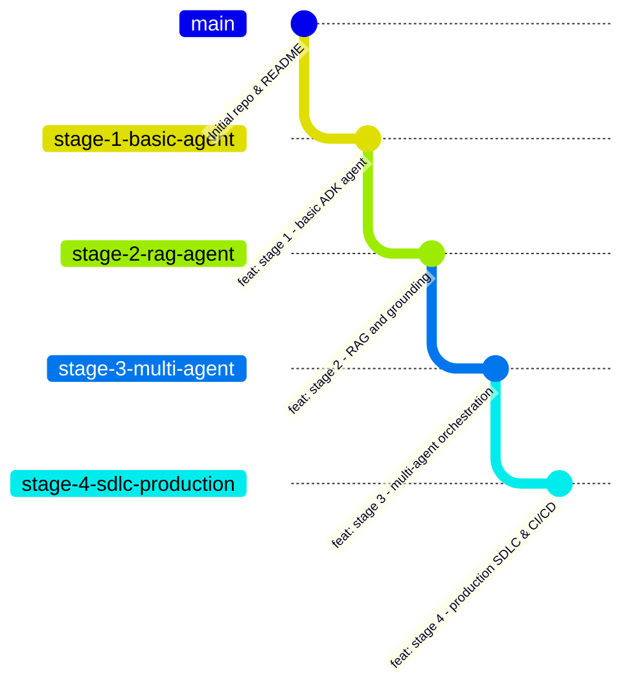

# SDLC Workshop & Progressive Agentic Course Generator

A comprehensive framework and automation toolkit for teaching and developing progressive, multi-stage agentic applications using **Google Agent Development Kit (ADK)**, **Git Worktrees**, **GitHub Comparison Pull Requests**, and **Prompt Trajectories**.

---

## 📖 Overview

When leading students or engineers through building complex agentic systems, showing the linear evolution from a basic agent to a production-ready multi-agent system can be challenging. Standard git checkouts cause IDE churn and make side-by-side comparison difficult.

This repository provides:
1. **An Interactive Setup Script (`setup-worktree-repo.sh`)** that prompts for project name, number of demo stages, branch names, and remote repository details—then automatically scaffolds sequential feature branches, local Git Worktrees for live demos, and open GitHub Pull Requests that display clean visual diffs between stages.
2. **A 4-Stage Progressive Blueprint** for teaching Google ADK application development.
3. **A Trajectory Walkthrough Toolkit (`walk-trajectories.sh` + `trajectories/`)** to interactively step through and replay the exact prompts that evolved the code at each stage.
4. **An automated `record-trajectory` Workspace Skill** that records your prompt trajectory as you build each stage for the first time.

---

## 🚀 Using `setup-worktree-repo.sh` for New Courses

The `setup-worktree-repo.sh` script is an **interactive CLI wizard** that automates creating a new GitHub repository configured for teaching any multi-stage progression.

### What the Interactive Wizard Prompts For
1. **Project Directory Name** (e.g. `adk-progressive-agent-course`)
2. **Number of Stages for Demoing** (default: `4`, supports any positive number)
3. **Branch Names for Each Stage** (with intelligent defaults like `stage-1-basic-agent`, `stage-2-rag-agent`, etc.)
4. **Remote GitHub Repository & Visibility** (e.g. `owner/repo-name`, `public` or `private`)

### Quickstart Guide

1. **Navigate to this workshop directory**:
   ```bash
   cd ~/git/sdlc-workshop
   ```

2. **Run the interactive setup script**:
   ```bash
   ./setup-worktree-repo.sh
   ```

3. **Answer the interactive prompts**:
   ```text
   1️⃣  What should I name the project directory? [default: adk-progressive-agent-course]: 
   2️⃣  How many stages will there be for demoing? [default: 4]: 
   ...
   ```

4. **Verify your local Worktree structure**:
   Once execution finishes, navigate into your generated course folder:
   ```text
   adk-progressive-agent-course/
   ├── README.md
   └── .worktrees/
       ├── stage-1/  # Checked out to Stage 1 branch
       ├── stage-2/  # Checked out to Stage 2 branch
       ├── stage-3/  # Checked out to Stage 3 branch
       └── stage-4/  # Checked out to Stage 4 branch
   ```

5. **Open in your IDE**:
   You can add each `.worktrees/stage-X` directory to your editor workspace to live-demo and compare stages side-by-side without ever running `git checkout`.

---

## 🏗️ 4-Stage Progressive ADK Architecture Plan



### Stage 1: Basic ADK Agent (`stage-1-basic-agent`)
* **Learning Objectives**: Fundamentals of Google ADK, defining an agent, system instructions, model parameters, and custom tools.

### Stage 2: RAG & Knowledge Grounding (`stage-2-rag-agent`)
* **Learning Objectives**: Vector search retrieval, knowledge grounding, and prompt engineering for source citation.

### Stage 3: Multi-Agent System (`stage-3-multi-agent`)
* **Learning Objectives**: Sub-agent specialization, Router/Coordinator orchestration patterns, and state hand-offs.

### Stage 4: Production SDLC & DevOps (`stage-4-sdlc-production`)
* **Learning Objectives**: ADK Quality Flywheel evaluations, CI/CD pipelines (GitHub Actions), containerization, and Cloud Trace observability.

---

## 🔀 GitHub Comparison PRs as a Teaching Aid

When teaching, direct your students to the **Pull Requests** tab of the generated GitHub repository. They will see open PRs automatically created between consecutive stages:
* **PR #1**: `stage-2` → base: `stage-1`
* **PR #2**: `stage-3` → base: `stage-2`
* ...

Students can click on **Files changed** in any PR to see an exact, clutter-free visual diff of what was added or modified to transform the application from one stage to the next.

---

## 🎯 Replaying Trajectories (`walk-trajectories.sh`)

During live demos, use the interactive trajectory walker:
```bash
./walk-trajectories.sh trajectories/stage_1.md --commit
```
It displays each step, **copies the prompt to your macOS clipboard (`pbcopy`)**, pauses while you paste it into your coding harness, and automatically creates a Git checkpoint.
